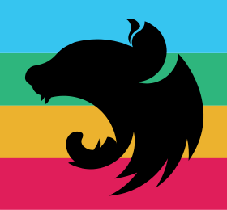

<p align="center">
<!-- ALL-CONTRIBUTORS-BADGE:START - Do not remove or modify this section -->
[](#contributors-)
<!-- ALL-CONTRIBUTORS-BADGE:END -->
  <a href="https://github.com/bamada/nest-slack-bolt" target="blank"></a>
</p>

[circleci-image]: https://img.shields.io/circleci/build/github/nestjs/nest/master?token=abc123def456
[circleci-url]: https://circleci.com/gh/nestjs/nest

<p align="center">A <a href="http://nestjs.com/" target="blank">Nestjs</a> module to interact with <a href="https://api.slack.com/" target="_blank">Slack</a> API using <a href="https://api.slack.com/bolt">Bolt</a> SDK</p>

[](https://github.com/prettier/prettier)

---

## Description

This module gives a handy way to develop Slack applications using the Nestjs framework

## Features

- Handle Messages
- Handle Commands
- Handle Actions
- Handle Events
- Handle Shortcuts

## Installation

```bash
# yarn
$ yarn add nestjs-slack-bolt

# npm
$ npm i nestjs-slack-bolt
```

## Usage

Add these variables to the `.env` file

```bash
# to define on API mode
SLACK_SIGNING_SECRET="**"

# to define on Socket mode
SLACK_APP_TOKEN="**"

# require variables
SLACK_BOT_TOKEN="**"
SLACK_SOCKET_MODE=true

```

Import the `SlackModule`

```typescript
import { Module } from '@nestjs/common';
import { SlackModule } from 'nestjs-slack-bolt';
import { AppController } from './app.controller';
import { AppService } from './app.service';

@Module({
  imports: [SlackModule.forRoot()],
  controllers: [AppController],
  providers: [AppService],
})
export class AppModule {}
```

## Example

Using annotations

```typescript
import { Controller } from '@nestjs/common';
import { Action, Command, Message, Event } from 'nestjs-slack-bolt';
import { AppService } from './app.service';
import {
  SlackActionMiddlewareArgs,
  SlackCommandMiddlewareArgs,
  SlackEventMiddlewareArgs,
} from '@slack/bolt';

@Controller()
export class AppController {
  constructor(private readonly appService: AppService) {}

  @Message('hi') //Handle a message event
  message({ say }: SlackEventMiddlewareArgs) {
    say('Hello');
  }

  @Action('click') //Handle an action
  action({ say }: SlackActionMiddlewareArgs) {
    say('click event received');
  }

  @Command('/list') // handle command
  command({ say }: SlackCommandMiddlewareArgs) {
    say('/list command received');
  }

  @Event('app_home_opened')
  event({ say }: SlackEventMiddlewareArgs) {
    say('app_open_event received');
  }

  @Shortcut('test_shortcut') //Handle a shortcut event
  async shortcut({ shortcut, ack, client, logger }) {
    try {
      // Acknowledge shortcut request
      await ack();

      // Call the views.open method using one of the built-in WebClients
      const result = await client.views.open({
        trigger_id: shortcut.trigger_id,
        view: {
          type: 'modal',
          title: {
            type: 'plain_text',
            text: 'My App',
          },
          close: {
            type: 'plain_text',
            text: 'Close',
          },
          blocks: [
            {
              type: 'section',
              text: {
                type: 'mrkdwn',
                text: 'About the simplest modal you could conceive of :smile:\n\nMaybe <https://api.slack.com/reference/block-kit/interactive-components|*make the modal interactive*> or <https://api.slack.com/surfaces/modals/using#modifying|*learn more advanced modal use cases*>.',
              },
            },
            {
              type: 'context',
              elements: [
                {
                  type: 'mrkdwn',
                  text: 'Psssst this modal was designed using <https://api.slack.com/tools/block-kit-builder|*Block Kit Builder*>',
                },
              ],
            },
          ],
        },
      });

      logger.info(result);
    } catch (error) {
      logger.error(error);
    }
  }
}
```

## Example

Using the SlackService

```typescript
import { Controller } from '@nestjs/common';
import { ConfigService } from '@nestjs/config';
import { SlackService } from 'nestjs-slack-bolt/services/slack.service';
import { Cron, CronExpression } from '@nestjs/schedule';
import { from } from 'rxjs';

@Controller()
export class AppController {
  constructor(
    private readonly slackService: SlackService,
    private readonly configService: ConfigService,
  ) {}

  @Cron(CronExpression.EVERY_10_SECONDS)
  cronJob() {
    this.searchUsers()
      .pipe()
      .subscribe((users) => {
        console.log(JSON.stringify(users));
      });
  }

  searchUsers(cursor?: string) {
    return from(
      this.slackService.client.users.list({
        token: this.configService.get('SLACK_BOT_TOKEN'),
        limit: 1,
        ...(cursor && { cursor }),
      }),
    );
  }
}
```

## TODO

- Improve testing
- handle additional slack events

## Contribute & Disclaimer

....

## Contributors ✨

Thanks goes to these wonderful people ([emoji key](https://allcontributors.org/docs/en/emoji-key)):

<!-- ALL-CONTRIBUTORS-LIST:START - Do not remove or modify this section -->
<!-- prettier-ignore-start -->
<!-- markdownlint-disable -->
<table>
  <tbody>
    <tr>
      <td align="center" valign="top" width="14.28%"><a href="https://github.com/bamada"><br /><sub><b>madcam</b></sub></a><br /><a href="https://github.com/bamada/nest-slack-bolt/commits?author=bamada" title="Tests">⚠️</a> <a href="https://github.com/bamada/nest-slack-bolt/commits?author=bamada" title="Code">💻</a> <a href="https://github.com/bamada/nest-slack-bolt/commits?author=bamada" title="Documentation">📖</a> <a href="https://github.com/bamada/nest-slack-bolt/issues?q=author%3Abamada" title="Bug reports">🐛</a></td>
      <td align="center" valign="top" width="14.28%"><a href="https://github.com/nadirabbas"><br /><sub><b>Nadir Abbas</b></sub></a><br /><a href="https://github.com/bamada/nest-slack-bolt/commits?author=nadirabbas" title="Tests">⚠️</a> <a href="https://github.com/bamada/nest-slack-bolt/commits?author=nadirabbas" title="Documentation">📖</a> <a href="https://github.com/bamada/nest-slack-bolt/issues?q=author%3Anadirabbas" title="Bug reports">🐛</a> <a href="https://github.com/bamada/nest-slack-bolt/commits?author=nadirabbas" title="Code">💻</a></td>
    </tr>
  </tbody>
</table>

<!-- markdownlint-restore -->
<!-- prettier-ignore-end -->

<!-- ALL-CONTRIBUTORS-LIST:END -->

This project follows the [all-contributors](https://github.com/all-contributors/all-contributors) specification. Contributions of any kind welcome!
